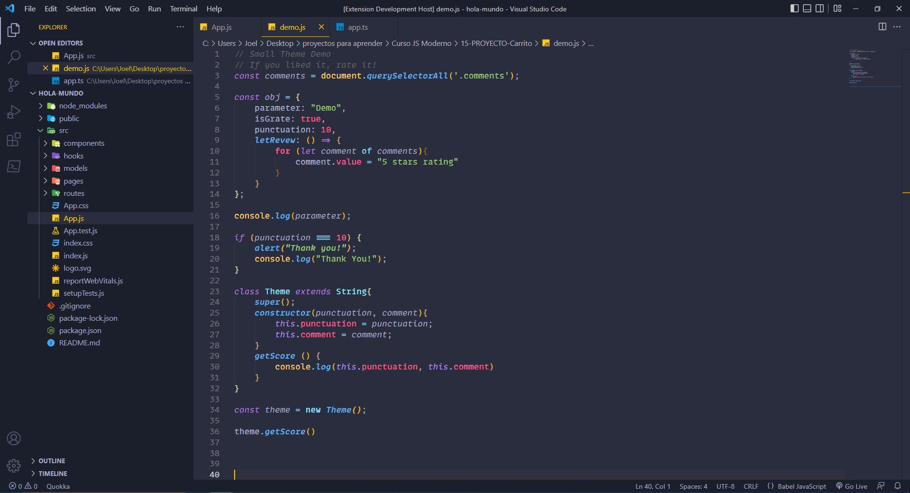
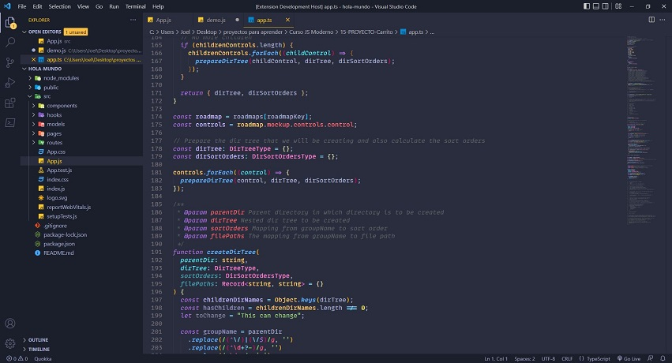
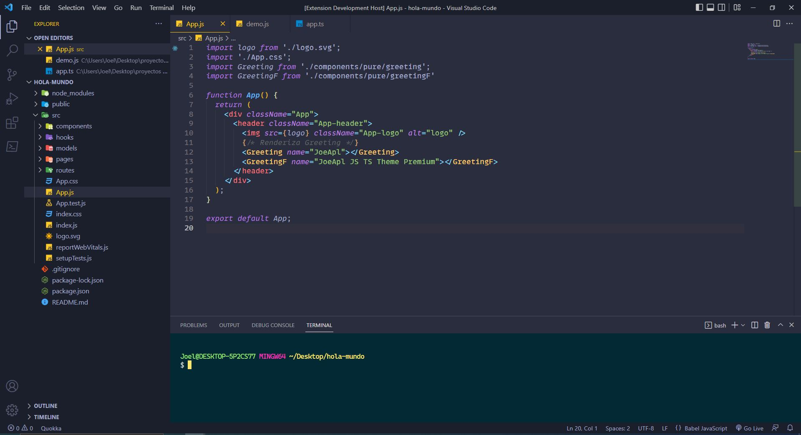
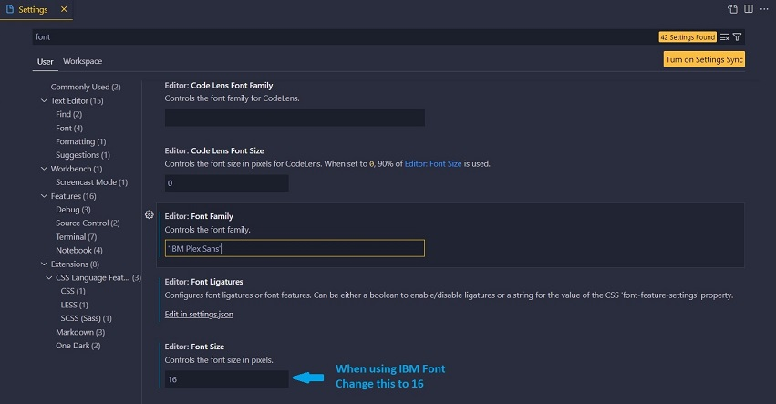
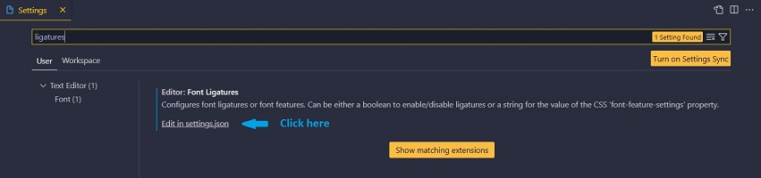
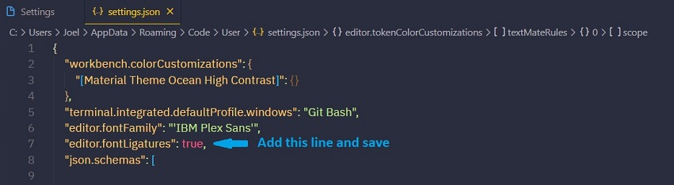

# JoeApl JS TS Premium Theme (free)

## Take a look

This theme has been created to make it easy to read and write using Javascript (react included), Typescript and added visual and understandable colors to HTML, CSS, and JSON files.

To use this theme I recommend installing the “IBM Plex Sans” font (free), at the end, there is a guide to install and
configure. I also recommend changing the terminal font for a better experience (more info at the end). If you want to use ligatures you can also install 'Cascadia Code Font'.

## Install fonts and configure ligature (optional)
* Go to [IBM Plex Sans](https://github.com/IBM/plex/releases/tag/v6.1.1) for more legibility or to [Cascadia Code](https://github.com/microsoft/cascadia-code/releases) to have ligatures. Download and install the font/s
* Go to settings and search "font". If you choose to use 'Cascadia Code' keep the size at 14, if you are using 'IBM Plex Sans' change the size to 16.

* If you are using 'Cascadia Code' you can habilitate the ligatures. Follow the steps in the next 2 images.

### You can also change the terminal font
* To do this go to settings and search for "terminal font" and change the Font Family. I recommend using [Hack](https://github.com/source-foundry/Hack) font or "Cascadia Code PL". If you decide to go with "Hack" font you will need to ignore the message "use monospace font" and restart the app to visualize the font on the terminal properly.

## For more information

* [Github Repository](https://github.com/apablazajoel/JoeApl-Premium-Theme)

### Thank you for the support!

**Created By Joel Apablaza**